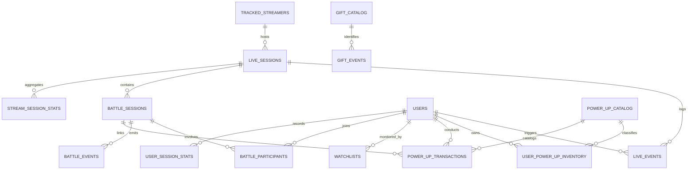

# AEP — Database Design & Storage Specification

## 1. Design Overview
The database layer uses **PostgreSQL 16/18** orchestrated via **Prisma ORM**.
It is designed to handle high write rates (millions of rows over 30 days) while providing rapid query response for real-time dashboards, user profiles, battle timelines, and weekly aggregations.

### Key Architectural Guidelines:
1. **Append-Only Raw Ledger (`live_events`)**:
   - Stores raw normalized events for audit, playback, and analytical reconstruction.
2. **Specialized Event Tables**:
   - `comment_events`, `like_events`, `gift_events`, `share_events`, `join_events`, `battle_events` for indexed sub-second relational queries.
3. **Power-Up Transaction Ledger (`power_up_transactions`)**:
   - Immutable double-entry style ledger.
   - `user_power_up_inventory` is a projection updated only through ledger transactions.
4. **Partitioning & 30-Day Retention**:
   - Tables with high volume (`live_events`, `comment_events`, `like_events`, `gift_events`, `share_events`, `join_events`) include `created_at_utc` with automated partition dropping or batch retention workers running daily at 03:00 UTC (06:00 Asia/Riyadh).

---

## 2. Relational Schema Architecture (PostgreSQL / Prisma)



---

## 3. Detailed Table Specifications

### 3.1 Core Streamer & Session Tables

#### `tracked_streamers`
- `id`: `UUID PRIMARY KEY DEFAULT gen_random_uuid()`
- `username`: `VARCHAR(128) UNIQUE NOT NULL` (e.g. "streamer1")
- `unique_id`: `VARCHAR(128)` (TikTok handle)
- `display_name`: `VARCHAR(256)`
- `profile_image`: `TEXT`
- `is_active`: `BOOLEAN DEFAULT TRUE`
- `monitoring_enabled`: `BOOLEAN DEFAULT TRUE`
- `status`: `VARCHAR(32) DEFAULT 'OFFLINE'` (`LIVE`, `OFFLINE`, `CONNECTING`, `DEGRADED`, `ERROR`)
- `last_live_at`: `TIMESTAMPTZ`
- `last_offline_at`: `TIMESTAMPTZ`
- `created_at`: `TIMESTAMPTZ DEFAULT NOW()`
- `updated_at`: `TIMESTAMPTZ DEFAULT NOW()`

#### `live_sessions`
- `id`: `UUID PRIMARY KEY DEFAULT gen_random_uuid()`
- `streamer_id`: `UUID NOT NULL REFERENCES tracked_streamers(id) ON DELETE CASCADE`
- `room_id`: `VARCHAR(64) NOT NULL`
- `status`: `VARCHAR(32) DEFAULT 'ACTIVE'` (`ACTIVE`, `ENDED`, `INTERRUPTED`)
- `started_at_utc`: `TIMESTAMPTZ NOT NULL DEFAULT NOW()`
- `ended_at_utc`: `TIMESTAMPTZ`
- `duration_seconds`: `INTEGER DEFAULT 0`
- `timezone`: `VARCHAR(64) DEFAULT 'Asia/Riyadh'`
- `peak_viewers`: `INTEGER DEFAULT 0`
- `total_comments`: `BIGINT DEFAULT 0`
- `total_likes`: `BIGINT DEFAULT 0`
- `total_shares`: `BIGINT DEFAULT 0`
- `total_gifts`: `BIGINT DEFAULT 0`
- `total_diamonds`: `BIGINT DEFAULT 0`
- `unique_participants`: `INTEGER DEFAULT 0`
- `created_at`: `TIMESTAMPTZ DEFAULT NOW()`
- `updated_at`: `TIMESTAMPTZ DEFAULT NOW()`
- *Indexes*: `(streamer_id, started_at_utc)`, `(room_id)`, `(status)`

---

### 3.2 User & Audience Intelligence Tables

#### `users`
- `id`: `UUID PRIMARY KEY DEFAULT gen_random_uuid()`
- `user_id`: `VARCHAR(64) UNIQUE NOT NULL` (TikTok persistent user ID)
- `unique_id`: `VARCHAR(128) NOT NULL` (handle without @)
- `nickname`: `VARCHAR(256) NOT NULL`
- `avatar_url`: `TEXT`
- `sec_uid`: `TEXT`
- `country`: `VARCHAR(8)`
- `badges`: `JSONB`
- `total_comments`: `BIGINT DEFAULT 0`
- `total_likes`: `BIGINT DEFAULT 0`
- `total_shares`: `BIGINT DEFAULT 0`
- `total_gifts`: `BIGINT DEFAULT 0`
- `total_diamonds`: `BIGINT DEFAULT 0`
- `total_battles_participated`: `INTEGER DEFAULT 0`
- `total_mvps`: `INTEGER DEFAULT 0`
- `first_seen_at`: `TIMESTAMPTZ NOT NULL DEFAULT NOW()`
- `last_seen_at`: `TIMESTAMPTZ NOT NULL DEFAULT NOW()`
- `created_at`: `TIMESTAMPTZ DEFAULT NOW()`
- `updated_at`: `TIMESTAMPTZ DEFAULT NOW()`
- *Indexes*: `(unique_id)`, `(total_diamonds DESC)`, `(last_seen_at DESC)`

#### `watchlists`
- `id`: `UUID PRIMARY KEY DEFAULT gen_random_uuid()`
- `user_id`: `UUID NOT NULL REFERENCES users(id) ON DELETE CASCADE`
- `note`: `TEXT`
- `is_active`: `BOOLEAN DEFAULT TRUE`
- `notify_comments`: `BOOLEAN DEFAULT TRUE`
- `notify_likes`: `BOOLEAN DEFAULT TRUE`
- `notify_shares`: `BOOLEAN DEFAULT TRUE`
- `notify_gifts`: `BOOLEAN DEFAULT TRUE`
- `notify_diamonds`: `BOOLEAN DEFAULT TRUE`
- `notify_battles`: `BOOLEAN DEFAULT TRUE`
- `notify_powerups`: `BOOLEAN DEFAULT TRUE`
- `notify_mvp`: `BOOLEAN DEFAULT TRUE`
- `created_at`: `TIMESTAMPTZ DEFAULT NOW()`
- `updated_at`: `TIMESTAMPTZ DEFAULT NOW()`
- *Indexes*: `(user_id, is_active)`

---

### 3.3 Raw Event Ledger & Granular Stream Data

#### `live_events` (Append-Only Ledger - 30-Day Window)
- `id`: `UUID PRIMARY KEY DEFAULT gen_random_uuid()`
- `provider`: `VARCHAR(64) NOT NULL`
- `provider_event_type`: `VARCHAR(64) NOT NULL`
- `provider_event_id`: `VARCHAR(128)`
- `provider_transaction_id`: `VARCHAR(128)`
- `stream_id`: `VARCHAR(64)`
- `session_id`: `UUID NOT NULL REFERENCES live_sessions(id) ON DELETE CASCADE`
- `user_id`: `UUID REFERENCES users(id) ON DELETE SET NULL`
- `event_type`: `VARCHAR(64) NOT NULL`
- `timestamp_utc`: `TIMESTAMPTZ NOT NULL`
- `payload_json`: `JSONB NOT NULL`
- `created_at`: `TIMESTAMPTZ NOT NULL DEFAULT NOW()`
- *Indexes*: `(session_id, timestamp_utc)`, `(event_type, timestamp_utc)`, `(user_id, timestamp_utc)`, `(created_at)`

#### `comment_events`
- `id`: `UUID PRIMARY KEY DEFAULT gen_random_uuid()`
- `session_id`: `UUID NOT NULL REFERENCES live_sessions(id) ON DELETE CASCADE`
- `user_id`: `UUID NOT NULL REFERENCES users(id) ON DELETE CASCADE`
- `comment_id`: `VARCHAR(128)`
- `comment_text`: `TEXT NOT NULL`
- `timestamp_utc`: `TIMESTAMPTZ NOT NULL`
- `created_at`: `TIMESTAMPTZ NOT NULL DEFAULT NOW()`
- *Indexes*: `(session_id, timestamp_utc)`, `(user_id, timestamp_utc)`

#### `gift_events`
- `id`: `UUID PRIMARY KEY DEFAULT gen_random_uuid()`
- `session_id`: `UUID NOT NULL REFERENCES live_sessions(id) ON DELETE CASCADE`
- `user_id`: `UUID NOT NULL REFERENCES users(id) ON DELETE CASCADE`
- `gift_id`: `VARCHAR(64) NOT NULL`
- `gift_name`: `VARCHAR(128) NOT NULL`
- `diamond_value`: `INTEGER NOT NULL`
- `repeat_count`: `INTEGER NOT NULL DEFAULT 1`
- `total_diamonds`: `BIGINT NOT NULL`
- `transaction_id`: `VARCHAR(128)`
- `timestamp_utc`: `TIMESTAMPTZ NOT NULL`
- `created_at`: `TIMESTAMPTZ NOT NULL DEFAULT NOW()`
- *Indexes*: `(session_id, total_diamonds DESC)`, `(user_id, timestamp_utc)`

#### `gift_catalog`
- `id`: `UUID PRIMARY KEY DEFAULT gen_random_uuid()`
- `gift_id`: `VARCHAR(64) UNIQUE NOT NULL`
- `name`: `VARCHAR(128) NOT NULL`
- `diamond_value`: `INTEGER NOT NULL DEFAULT 0`
- `image_url`: `TEXT`
- `category`: `VARCHAR(64)`
- `is_active`: `BOOLEAN DEFAULT TRUE`
- `first_seen_at`: `TIMESTAMPTZ DEFAULT NOW()`
- `last_seen_at`: `TIMESTAMPTZ DEFAULT NOW()`

---

### 3.4 Battle (PK) Intelligence Tables

#### `battle_sessions`
- `id`: `UUID PRIMARY KEY DEFAULT gen_random_uuid()`
- `battle_id`: `VARCHAR(64) UNIQUE NOT NULL`
- `stream_session_id`: `UUID NOT NULL REFERENCES live_sessions(id) ON DELETE CASCADE`
- `battle_type`: `VARCHAR(32) NOT NULL DEFAULT '1v1'` (`1v1`, `2v2`, `MULTI`)
- `status`: `VARCHAR(32) NOT NULL DEFAULT 'IN_PROGRESS'` (`IN_PROGRESS`, `FINISHED`, `ABORTED`)
- `started_at`: `TIMESTAMPTZ NOT NULL`
- `ended_at`: `TIMESTAMPTZ`
- `duration_seconds`: `INTEGER DEFAULT 0`
- `winning_team_id`: `VARCHAR(64)`
- `is_draw`: `BOOLEAN DEFAULT FALSE`
- `created_at`: `TIMESTAMPTZ DEFAULT NOW()`
- `updated_at`: `TIMESTAMPTZ DEFAULT NOW()`
- *Indexes*: `(stream_session_id, started_at)`, `(status)`

#### `battle_participants`
- `id`: `UUID PRIMARY KEY DEFAULT gen_random_uuid()`
- `battle_session_id`: `UUID NOT NULL REFERENCES battle_sessions(id) ON DELETE CASCADE`
- `user_id`: `UUID NOT NULL REFERENCES users(id) ON DELETE CASCADE`
- `team_id`: `VARCHAR(64) NOT NULL` (e.g. "TEAM_A", "TEAM_B")
- `role`: `VARCHAR(32) NOT NULL` (`HOST`, `GUEST`, `SUPPORTER`, `MVP`)
- `score`: `BIGINT DEFAULT 0`
- `likes_count`: `BIGINT DEFAULT 0`
- `gifts_count`: `INTEGER DEFAULT 0`
- `diamonds_count`: `BIGINT DEFAULT 0`
- `is_mvp`: `BOOLEAN DEFAULT FALSE`
- `created_at`: `TIMESTAMPTZ DEFAULT NOW()`
- *Indexes*: `(battle_session_id, team_id)`, `(user_id)`

#### `battle_events`
- `id`: `UUID PRIMARY KEY DEFAULT gen_random_uuid()`
- `battle_session_id`: `UUID NOT NULL REFERENCES battle_sessions(id) ON DELETE CASCADE`
- `event_type`: `VARCHAR(64) NOT NULL` (e.g. "SCORE_UPDATE", "MVP_CHANGE", "POWERUP_TRIGGER", "PUNISH_START")
- `payload`: `JSONB NOT NULL`
- `timestamp_utc`: `TIMESTAMPTZ NOT NULL`
- `created_at`: `TIMESTAMPTZ DEFAULT NOW()`
- *Indexes*: `(battle_session_id, timestamp_utc)`

---

### 3.5 Power-Up & Battle Tools Intelligence

#### `power_up_catalog`
- `id`: `UUID PRIMARY KEY DEFAULT gen_random_uuid()`
- `code`: `VARCHAR(64) UNIQUE NOT NULL` (`GLOVES`, `MIST`, `THUNDER`, `BOOST_X2`, `BOOST_X3`, `EXTRA_TIME`, `MATCH_GUIDE`)
- `name_ar`: `VARCHAR(128) NOT NULL` (e.g. "قفازات", "ضباب", "رعد")
- `name_en`: `VARCHAR(128) NOT NULL`
- `type`: `VARCHAR(64) NOT NULL` (`MULTIPLIER`, `OBFUSCATION`, `STRIKE`, `TIME_EXTENSION`, `STRATEGY`)
- `multiplier`: `DOUBLE PRECISION DEFAULT 1.0`
- `duration_seconds`: `INTEGER DEFAULT 0`
- `icon_name`: `VARCHAR(64)`
- `asset_url`: `TEXT`
- `is_active`: `BOOLEAN DEFAULT TRUE`
- `created_at`: `TIMESTAMPTZ DEFAULT NOW()`
- `updated_at`: `TIMESTAMPTZ DEFAULT NOW()`

#### `user_power_up_inventory`
- `id`: `UUID PRIMARY KEY DEFAULT gen_random_uuid()`
- `user_id`: `UUID NOT NULL REFERENCES users(id) ON DELETE CASCADE`
- `power_up_id`: `UUID NOT NULL REFERENCES power_up_catalog(id) ON DELETE CASCADE`
- `quantity`: `INTEGER NOT NULL DEFAULT 0 CHECK (quantity >= 0)`
- `total_acquired`: `INTEGER NOT NULL DEFAULT 0`
- `total_used`: `INTEGER NOT NULL DEFAULT 0`
- `last_acquired_at`: `TIMESTAMPTZ`
- `last_used_at`: `TIMESTAMPTZ`
- `updated_at`: `TIMESTAMPTZ DEFAULT NOW()`
- *Constraints*: `UNIQUE(user_id, power_up_id)`
- *Indexes*: `(user_id)`, `(power_up_id)`

#### `power_up_transactions` (Single Source of Truth)
- `id`: `UUID PRIMARY KEY DEFAULT gen_random_uuid()`
- `user_id`: `UUID NOT NULL REFERENCES users(id) ON DELETE CASCADE`
- `power_up_id`: `UUID NOT NULL REFERENCES power_up_catalog(id) ON DELETE CASCADE`
- `stream_session_id`: `UUID REFERENCES live_sessions(id) ON DELETE SET NULL`
- `battle_session_id`: `UUID REFERENCES battle_sessions(id) ON DELETE SET NULL`
- `transaction_type`: `VARCHAR(32) NOT NULL` (`ACQUIRED`, `USED`, `EXPIRED`, `ADJUSTED`, `UNKNOWN`)
- `quantity`: `INTEGER NOT NULL` (Positive for ACQUIRED, negative for USED)
- `quantity_before`: `INTEGER NOT NULL`
- `quantity_after`: `INTEGER NOT NULL CHECK (quantity_after >= 0)`
- `source_event_id`: `VARCHAR(128)`
- `source_transaction_id`: `VARCHAR(128)`
- `evidence_notes`: `TEXT NOT NULL`
- `occurred_at`: `TIMESTAMPTZ NOT NULL`
- `created_at`: `TIMESTAMPTZ DEFAULT NOW()`
- *Indexes*: `(user_id, occurred_at DESC)`, `(battle_session_id)`, `(transaction_type)`

#### `weekly_power_up_snapshots`
- `id`: `UUID PRIMARY KEY DEFAULT gen_random_uuid()`
- `week_start_utc`: `TIMESTAMPTZ NOT NULL`
- `week_end_utc`: `TIMESTAMPTZ NOT NULL`
- `user_id`: `UUID NOT NULL REFERENCES users(id) ON DELETE CASCADE`
- `power_up_id`: `UUID NOT NULL REFERENCES power_up_catalog(id) ON DELETE CASCADE`
- `total_acquired`: `INTEGER NOT NULL DEFAULT 0`
- `total_used`: `INTEGER NOT NULL DEFAULT 0`
- `balance_remaining`: `INTEGER NOT NULL DEFAULT 0`
- `created_at`: `TIMESTAMPTZ DEFAULT NOW()`
- *Constraints*: `UNIQUE(week_start_utc, user_id, power_up_id)`
- *Indexes*: `(week_start_utc, user_id)`

---

## 4. 30-Day Retention Policy & Automated Cleanup

All granular event logs, raw frames, and session details are preserved for 30 days.

```sql
-- Scheduled SQL routine executed daily at 03:00 UTC
DELETE FROM live_events WHERE created_at < NOW() - INTERVAL '30 days';
DELETE FROM comment_events WHERE created_at < NOW() - INTERVAL '30 days';
DELETE FROM like_events WHERE created_at < NOW() - INTERVAL '30 days';
DELETE FROM share_events WHERE created_at < NOW() - INTERVAL '30 days';
DELETE FROM gift_events WHERE created_at < NOW() - INTERVAL '30 days';
DELETE FROM battle_events WHERE created_at < NOW() - INTERVAL '30 days';
DELETE FROM power_up_transactions WHERE created_at < NOW() - INTERVAL '30 days';
```

Weekly aggregated snapshots and total user profile lifetime counters (`total_diamonds`, `total_comments`, `total_mvps`) persist indefinitely for long-term historical comparison without retaining individual high-volume payloads.
